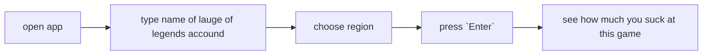

## Watcher
an tui to check how much u suck at leauge of legends.
## How to use




## Installation 
#### linux:
```bash 
git clone https://github.com/Horryportier/Watcher
cd Watcher
go install -v 
# if your go/bin is not in your path.
export PATH=$PATH:/home/$(whoami)/go/bin
```


## TO implemet:
- [x] chooise of region
- [ ] flags (to search from terminal)
- [x] dashboard view (all important stats)
- [ ] list of recently played games
### maybe:
- [ ] saving of searched accounds
- [ ] stats over time
__

### Tools: 
- [bubbletea](https://github.com/charmbracelet/bubbletea)
- [lipgloss](https://github.com/charmbracelet/lipgloss)
